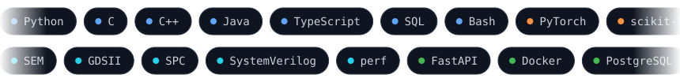

  

  

  
  

  
  

  <picture>
    <source media="(prefers-color-scheme: dark)" srcset="https://raw.githubusercontent.com/Sachin0496/Sachin0496/output/github-snake-dark.svg">
    
  </picture>

The projects are in the <a href="https://github.com/Sachin0496?tab=repositories">repositories</a>. They make the case better than a paragraph would.

